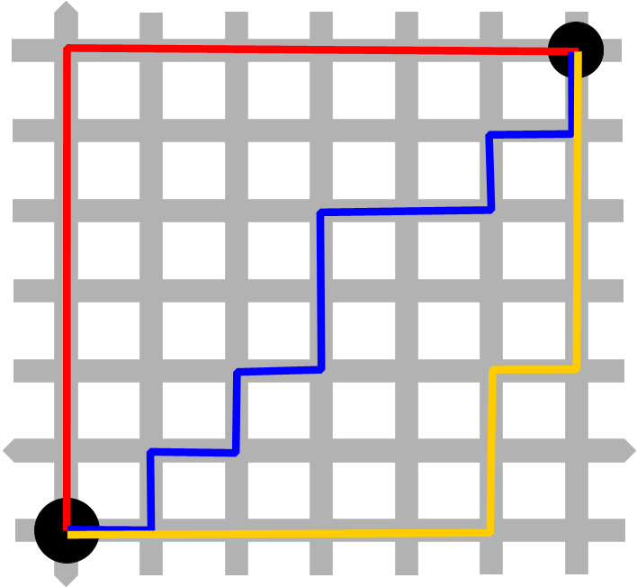
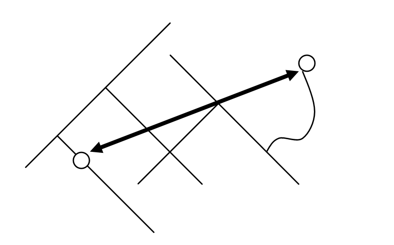
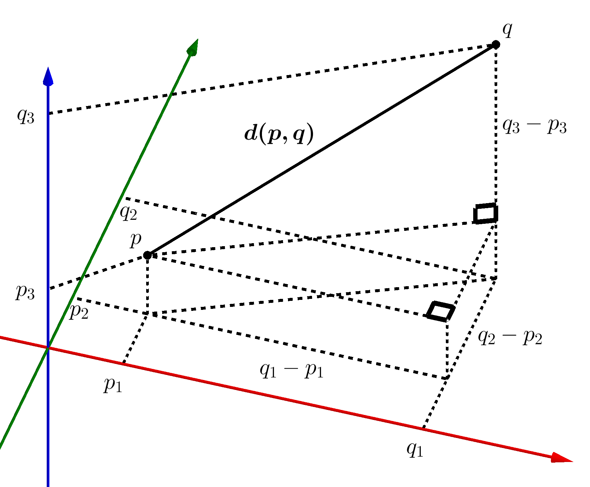

There are a lot of terms out there being thrown around surrounding machine learning, deep learning, and artificial intelligence. They are different things and mean different things, but overlap and are related. I would like to share today what my experience with machine learning has been and discuss some of the tools used in machine learning.

# Machine Learning

First, machine learning can be used with any mathematical function that can have a loss or gain function calculated. This means that there could be multiple correct solutions to the problem at hand. Loss and gain will be defined below. There are two primary types of machine learning, supervised and unsupervised learning. Both types use a loss or gain function to "learn". Both supervised and unsupervised learning will be discussed in further detail below. Additionally, machine learning does not require a neural network, but can make use of one.

## Loss

Loss can be described as a measure of how far away from the target output the calculated output is. Simply put, it is the difference between the target and calculated outputs. There are different types of loss that can be calculated, just as there are different types of distances. Manhattan, Euclidian, and Minkowski distances are commonly used.

### Manhattan Distance

Manhattan distance can be determined by calculating the sum of all side lengths to the first power, or by using the following formula:


```
manhattan_distance = np.power((length_side_1 + length_side_2 + ... length_side_n)**1 , 1/1)
```


The lengths in the formula are determined by using a grid pattern over the original function, much like the area in New York, as can be seen in Figure 1.


Figure 1. Manhattan distance grid pattern.
<br>
<br>

In this image, the red, blue, and yellow lines are all different Manhattan distances. Manhattan distance is the simplest distance mathematically to calculate for. Pay special attention to the exponent and the second value in the np.power() function as the other distances are explained.

### Euclidian Distance

Euclidian distance can be found by calculating the square root of the sum of all side lengths to the second power, or by using the following formula:


```
euclidean_distance = np.power((length_side_1 + length_side_2 + ... length_side_n)**2, 1/2)
```


Euclidian distance is based on the Pythagorean theorem, which is probably familiar to you as a<sup>2</sup> + b<sup>2</sup> = c <sup>2</sup>, as can be seen in Figure 2.


<br>
<br>

Another way to view Euclidian distance is as the shortest way to get from one point to another, or 'as the crow flies'. The primary difference between Manhattan distance and Euclidian distance is that Manhattan can only be used for 2D spaces, whereas Euclidian distance can be used for 3D space, as seen in Figure 3. This means that Euclidian distance is more flexible and can be used for more complex features.


<br>
<br>

In this image all of the p points are referencing the lower point, just on the three different axes, x, in red, y, in green, and z, in blue. Just as all of the q points are referencing the higher point. This images shows how complex loss functions can be to calculate by hand. In using programming, specifically in this case machine learning, the optimal solution can be found more quickly.

### Minkowski Distance

The Minkowski distance is the distance between two points in a normed vector space. A normed vector space is a space in which some sort of norm has been defined. Basically all of that means that Minkowski distance is the distance between two points in which the distance metrics are identified and related to each other, like length in meters or feet. It is a generalization of both Manhattan and Euclidian distance. Minkowski distance can be found by taking the nth root of the sum of all side lengths to the nth power, calculated using the following formula:

```
minkowski_distance = np.power((length_side_1 + length_side_2 + ... length_side_n)**n, 1/n)
```


The generalization can be seen in the exponent and the second value in the np.power() function. One caveat to the Minkowski distance is that all values must be positive. That makes it particularly useful when data has been scaled. When data is scaled that normed vector space is created.

Generally, loss is determined by the distance from the intended target to the calculated for variable. The keyword for loss is distance. The maximization or minimization of loss as various potentially correct solutions are tried out allows for "learning" to occur.

## Gain

Gain is a little bit different from loss. There are different types of gain that can be calculated for. This category encompasses information gain, entropy, and the Gini index, otherwise known as the Gini penalty. All of these different measures discuss the integrity of the target variable. The target variable is the variable of interest or the variable to be solved for.

### Entropy

Entropy, in this case Shannon's version of it, for the chemist's out there, is a measure of certainty or uncertainty, and is the measure of the information able to be contained in a variable. Measuring entropy before and after a calculation can allow for "learning" to take place by selecting for entropy to be maximized or minimized.

Entropy can be calculated by using the following function:

```
def entropy(pi): # where pi is a list of class distributions
    """
    return the Entropy of a probability distribution:
    entropy(p) = - SUM (Pi * log(Pi) )
    """
    from math import log
    total = 0
    for p in pi:
        p = p / sum(pi)
        if p != 0:
            total +=  p * log(p, 2)
        else:
            total += 0
    total *= -1
    return total
```


### Information Gain

Information gain measures how much information a feature gives about a certain class by measuring its impurity, or uncertainty, using entropy. It can be calculated by using the following function:

```
def IG(D, a): #  take in D as a class distribution array for target class, and a the class distribution of the attribute to be tested
    """
    return the information gain:
    gain(D, A) = entropy(D)− SUM( |Di| / |D| * entropy(Di) )
    """

    total = 0
    for Di in a:
        total += abs(sum(Di) / sum(D)) * entropy(Di)

    gain = entropy(D) - total
    return gain
```


In the case of this function for information gain, D is the target's distribution, and a is the calculated variable's distribution. The letter i in both this information gain and the entropy formula represents the probability of the associated value. So, Di is the probability, or is a single value in the associated distribution list. For information gain, from the total information in a variable, we're subtracting the likelihood of attaining a certain value. This in essence gives weight to the feature. So things with more weight will be considered more frequently than things with less weight. This skews the "learning" part to the things that are more probable to happen.

### Gini Index

The Gini index, or Gini penalty, calculates the probability of being wrong when shooting in the dark. So, it still has a target and a calculated variable. The calculated variable is picked at random and compared to the target variable, and as the number of times the calculated variable is wrong increases, the Gini index also increases. It can be calculated using the following formula:

```
def gini(pi): # where pi is a list of class distributions
  """
  return the gini index of a class distribution:
  gini(p) = 1 - sum(Pi)**2
  """
  total = 0
  for p in pi:
    p = p / sum(pi)
    if p != 0:
        total += p**2
    else:
        total += 0
  total = 1 - total
  return total
```


From this function, you can see that there are some similarities between the Gini index and entropy. They both discuss integrity of the calculated values, as does information gain for the class.

Both loss and gain can work together to assist in the "learning" that happens when training a machine learning model. Selecting which type of both to use can have a large impact on the model created in the end. Each type of loss and gain can lend itself to either supervised or unsupervised learning, largely depending on the data structure itself or what the goals of the developed algorithm are.

## Supervised Learning

In supervised learning the target variable is known before starting the machine learning process, otherwise known as having labeled data. This means that the target variable and the calculated variable can be directly compared and use any of the distance types in loss for comparison. Also any type of gain can be used to optimize performance.

## Unsupervised Learning

In unsupervised learning, one of two things needs to happen before any calculations are done to improve an algorithm. The data is either split into different clusters using a process called k-means or is reduced in dimensionality by eliminating features that don't contribute information to the dataset. Each point of data is now associated with a cluster or dimension reduction, and this serves as the "label", or the target variable. Once this is done, then the process for unsupervised learning proceeds similarly to the process for supervised learning in that any of the loss or gain types can be used to increase the accuracy of the model.

So, machine learning uses loss and gain functions as mathematical tools to improve accuracy by either increasing or decreasing the selected value each time the algorithm is run.
